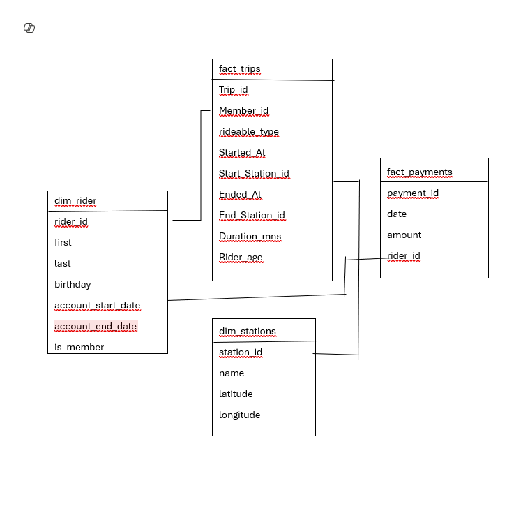
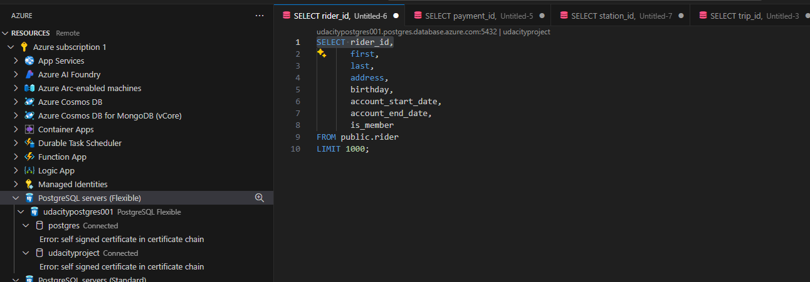
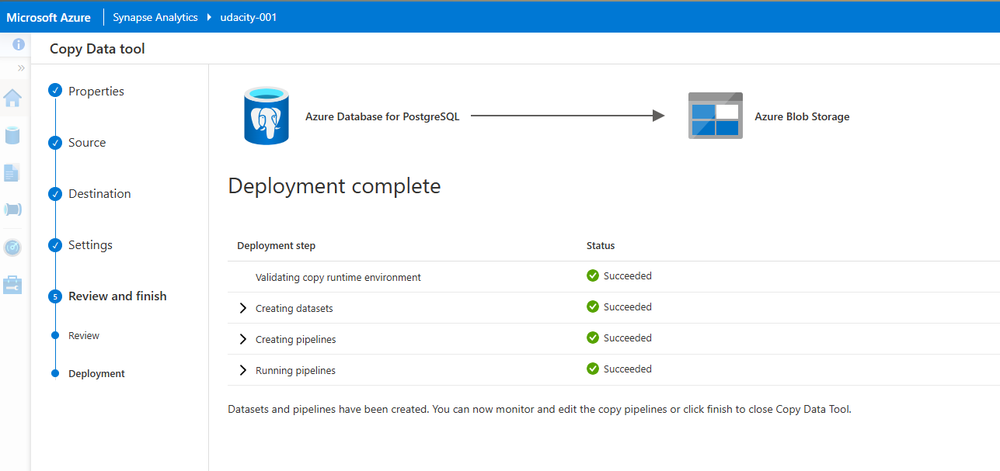
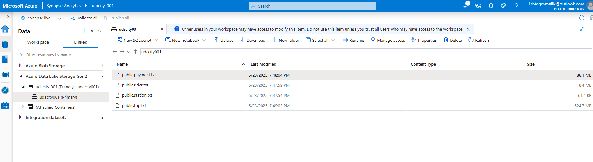
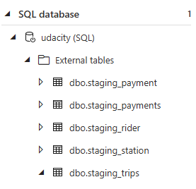
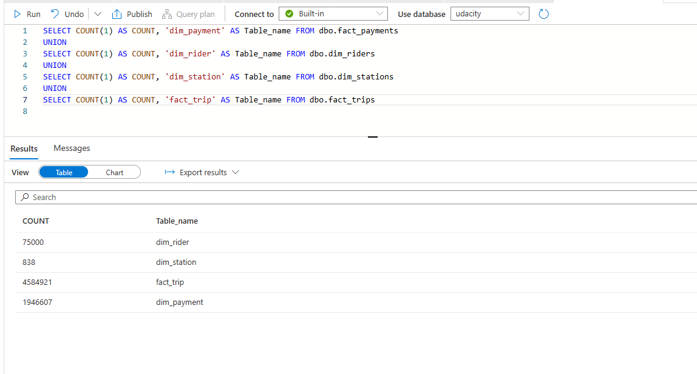

# 🚲 Divvy Bike Share Analytics Project
**Azure Synapse Analytics + PostgreSQL Integration**

---

## 📌 Project Summary

This project builds a cloud-based data warehouse in **Azure Synapse Analytics** using public Divvy Bike Share data from Chicago. The goal is to analyze ride behavior and payment trends to support key business outcomes.

---

## 📂 Tasks Overview

### 🛠 Task 1: Azure Resources Setup

✅ Steps:
- [x] **Azure Database for PostgreSQL** – OLTP source system  
- [x] **Azure Synapse Workspace** – Data warehouse  
- [x] **Serverless SQL Pool** – Used for querying & transformation  

  

---

### ⭐ Task 2: Star Schema Design

You designed a **star schema** based on:
- Business goals (duration, spending, rider behaviour)
- Source relational schema from PostgreSQL

📁 Schema includes:
- `fact_rides`  
- `fact_payment`  
- `dim_rider`  
- `dim_station`  

---

### 📃 Task 3: Create Data in PostgreSQL

✅ Used Python script: `ProjectDataToPostgres.py`  
- Populates 4 tables in PostgreSQL with CSV data  
- Verified using pgAdmin  

📸

---

### 📄 Task 4: Extract Data to Azure Blob Storage

✅ Used **Synapse Ingest Wizard** to extract data from PostgreSQL to Azure Blob Storage.  
- Data for all 4 tables exported as `.txt` files  
- Files now accessible via Data Lake Linked Service

---

### 📅 Task 5: Load Data into External Tables

✅ Used **scripts** to create **external staging tables** in serverless SQL pool.  
- Loaded text into Synapse external tables using `CREATE EXTERNAL TABLE`

---

### 🔄 Task 6: Transform to Star Schema (CETAS)

✅ Used **CETAS (Create External Table AS SELECT)** to:
- Join & transform staging data
- Materialize star schema tables (`fact_rides`, `fact_payment`, etc.)

🧹 Highlights:
- Defined file format `SynapseDelimitedTextFormat`
- Reused external data source
- Created output folders like `/fact_payment/`, `/fact_rides/`

[!star schema tables](AzureScreensots/tablesblob.png)

---

## 🔎 Sample Analytics Questions

💬 **Ride Analysis**
- Average duration by station and hour
- Member vs. casual rider behavior
- Rider age impact on ride length

💬 **Payment Analysis**
- Total revenue by quarter
- Member spending by age
- Cost per ride / per rider / per month

---

## ✅ Deliverables

- ☑️ Star schema with `fact_rides` and `fact_payment`
- ☑️ Working serverless SQL queries over external tables
- ☑️ Screenshots showing setup, data flow, and CETAS outputs
- ☑️ Blob Storage linked with Synapse Workspace

---

## 📌 Notes

- External tables are **read-only views** into blob storage
- Star schema transformations are persisted as **partitioned txts** in Data Lake
  

